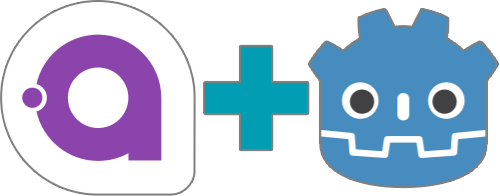

# Estragonia

Estragonia is a bridge allowing to use the powerful [Avalonia UI](https://github.com/AvaloniaUI/Avalonia/) framework in the no less powerful [Godot](https://github.com/godotengine/godot/) game engine!  
It's GPU accelerated using Vulkan, which is the main renderer used in Godot 4.

## Quick Start

1. Have Godot 4.1.0 RC2 with .NET support installed.
2. Install the `JLeb.Estragonia` NuGet package inside your project.
3. Initialize the Avalonia application using `UseGodot().SetupWithoutStarting()`.
4. Create a Godot `Control` node, assign it a script inheriting from `JLeb.Estragonia.AvaloniaControl` and populate its `Control` property with any valid Avalonia view.

For a more detailed guide, see the [step by step instructions](docs/setup.md).  
For a more complete project, see the [GameMenu sample](samples/GameMenu).
For various things to know regarding rendering and input handling, see the [this document](docs/toknow.md).

## License

The whole Estragonia project source code is under the [MIT License](license.txt).  
Some other licenses may apply to assets used in the samples. See each sample for more information.

## Samples

 - [HelloWorld](samples/HelloWorld): a basic Avalonia-into-Godot setup.
 - [GameMenu](samples/GameMenu): a functional game menu UI using the MVVM pattern, with controller support. 

